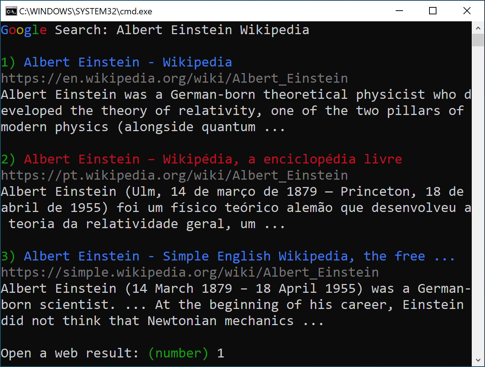

# G Search CLI

**DISCLAIMER: This is not a Google product or endorsed by Google.**

Ever wanted to do web searches from the confort of your terminal? Are you tired of having to reach for your mouse to click the search link you want? The solution is finally here: A fully command line-based Google Search interface!




## How to Use

*NOTE: Currently only Windows systems are supported. If you can make it run on another platform, please send a Pull Request. I reckon the only changes needed are in `util.py`.*

1. Make sure [Python 3.8](https://www.python.org/downloads/) is installed on your system. Other versions since Python 3.5 may work.

2. This tool depends on the Python library [Colorama](https://pypi.org/project/colorama/) for using colors on the terminal. Install it by running:
```
python -m pip install colorama
```

2. Set up some alias or shortcut for this tool on your terminal:

```
python g-search-cli/main.py
```

3. Run the tool, type in a search query and press enter.

4. Type the number corresponding to the search result you want to open and press enter. Your default browser should appear.

3. Enjoy!

## Additional features

* After you are shown the query results, you may type another search query instead of a number.
* You may type `"-r"` (without quotes) to *repeat* the last query. This works even as the first query, as the tool saves the last performed search query on disk before exiting.
* You may type `"-a <some text>"` (without quotes) to make a new query *apending* to the last query. This works even as the first command, as the tool saves the last performed search query on disk before exiting.
* You may type `"-b"` (without quotes) to go *back* to the previous query, similarly to an "undo" command. You can do that multiple times, but only supports queries done during the current session.


## Configuration

Check comments on `config.py` for details about setting up your own `config.env` file to customize the behavior of this tool.


## Terms of Service

**By using this tool, you are agreeing to [Google's Terms of Service](https://policies.google.com/terms)**. Note that automated querying and scraping of search results is [against Google's Terms of Services](https://support.google.com/webmasters/answer/66357?hl=en), so only use this tool as you would use a regular web browser.

**DISCLAIMER: This is not a Google product or endorsed by Google.**


## Development TODOs

- [ ] deal with "did you mean" queries (spell correction)
- [ ] sometimes the description is not correctly parsed and only the date is shown. example query: "albert einstein space"
- [ ] add command to copy url to clipboard
- [ ] support "i'm feeling lucky" (opening the first result without showing all results)
- [ ] improve the discoverability of "-a", "-r" and "-b" commands.
- [ ] add option to disable terminal colors
- [x] deal with the case where there is no results
- [x] load cookies from a local file in .gitignore
